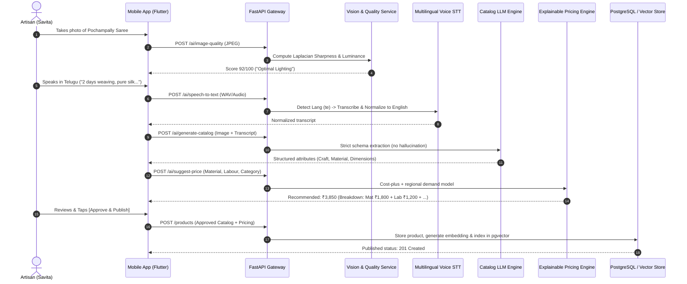

# ARCHITECTURE.md: KARIGASETU AI

## 1. High-Level System Architecture

KARIGASETU AI is architected using **Clean Architecture** principles across both the Flutter mobile client and the Python FastAPI backend to ensure maintainability, testability, and clear separation of concerns.

```
+-------------------------------------------------------------------------+
|                           FLUTTER CLIENT                                |
|  [Presentation Layer]                                                   |
|   - 3D Widgets (DepthCard, Product3DCard, Stat3DCard, HeroSalesCard)    |
|   - Screens (Onboarding, Scanner, Cataloguing, Pricing, RFQ, Admin)     |
|  [State & Business Logic]                                               |
|   - Providers / Notifiers (Auth, Scanner, Catalog, RFQ, Cart, Theme)    |
|  [Data Layer]                                                           |
|   - Repositories & API Client (Dio/Http, SecureTokenStore)              |
|   - Local Storage (SQLite Local Database, Sync Queue Manager)           |
+------------------------------------+------------------------------------+
                                     | HTTPS / JSON REST
                                     v
+------------------------------------+------------------------------------+
|                         FASTAPI BACKEND                                 |
|  [API Routers]                                                          |
|   - /auth, /seller, /buyer, /products, /ai, /search, /rfqs, /admin      |
|  [Security & Middleware]                                                |
|   - JWT Auth Bearer, CORS, Rate Limiting, Audit Logging                 |
|  [Domain Services & Business Logic]                                     |
|   - ImageQualityAnalyzer, ImageEnhancerService, RegionalSTTService      |
|   - LLMCatalogGenerator, ExplainablePricingEngine, SixFactorMatcher     |
|   - GoogleLensAdapter, ONDCProtocolAdapter                              |
|  [Data Persistence & Caching]                                           |
|   - SQLAlchemy Async ORM (PostgreSQL + pgvector / SQLite abstraction)   |
|   - Redis In-Memory Cache (Semantic search & session tokens)            |
+-------------------------------------------------------------------------+
```

---

## 2. The Hero Data Flow (One Photo + One Voice -> Published Product)



---

## 3. Core Subsystems

### 3.1 3D & Depth Visual Engine
The mobile UI employs an efficient **2.5D perspective engine**:
* **`DepthCard`**: Implements custom matrix transformations `Matrix4.identity()..setEntry(3, 2, 0.001)` to render elevation and shadow depth with tactile touch response.
* **`Product3DCard`**: Tracks pointer movements to introduce a subtle gyroscope-style perspective tilt and multi-layered parallax image shifting.
* **`HeroSalesCard`**: High-contrast, floating glassmorphic card with dynamic Bezier wave charts and glow accents.

### 3.2 AI Vision & Enhancement Pipeline
* **Sharpness Metric**: Computes variance of the Laplacian across grayscale image channels. Low variance (<100) indicates blur.
* **Lighting Metric**: Analyzes mean pixel luminance and histogram spread. Flags under-exposed (<60) or over-exposed (>210) captures.
* **Image Enhancer**: Equalizes histogram, sharpens edges, balances contrast, and normalizes aspect ratio without modifying authentic product textures.

### 3.3 Voice & Multilingual Engine
* Supports Indian languages: **Telugu (`te`), Hindi (`hi`), Tamil (`ta`), Kannada (`kn`), Marathi (`mr`), Bengali (`bn`), and English (`en`)**.
* Pipeline captures raw audio, executes speech recognition, tags detected language code, normalizes regional units (e.g., "గజాలు" -> meters), and extracts key craft characteristics.

### 3.4 Explainable Pricing Engine
Calculates transparent price recommendations using cost-plus and demand adjustment:
$$\text{Price} = C_{\text{material}} + (T_{\text{labour}} \times R_{\text{labour}}) + C_{\text{packaging}} + C_{\text{shipping}} + \text{Base Margin} + \Delta_{\text{demand}}$$
* Generates clear, non-black-box justification cards showing artisans exactly where every rupee comes from.

### 3.5 6-Factor Buyer-Artisan Matching Algorithm
Computes a compatibility score between buyer RFQs and verified artisans:
$$S = 0.30 S_{\text{product}} + 0.20 S_{\text{price}} + 0.15 S_{\text{capacity}} + 0.15 S_{\text{location}} + 0.10 S_{\text{leadtime}} + 0.10 S_{\text{trust}}$$
Provides human-readable reasons (e.g., *"✓ Capacity matches 100 units"*, *"✓ Within target budget"*).

### 3.6 External Integration Layer
* **Google Lens**: Abstracted through `LensService`. On Android, launches the `com.google.ar.lens` intent or Google search lens URI with fallback to in-app semantic visual search.
* **ONDC Protocol Adapter**: Standardized schema mapping (`ONDC:RET10` for handicrafts) ready for Beckn protocol gateways and sandbox networks.

---

## 4. Security & Compliance Architecture
1. **Passwordless Authentication**: Users log in via Google OAuth 2.0 or 6-digit cryptographic OTPs delivered to email/SMS.
2. **JWT Session Management**: HS256 signed access tokens with 24-hour expiration, stored in Flutter's `flutter_secure_storage` / Android KeyStore.
3. **Role-Based Access Control (RBAC)**: Strict separation of `SELLER`, `BUYER`, and `ADMIN` endpoints via FastAPI dependency guards.
4. **Input Sanitization**: Pydantic v2 schemas enforce strict validation against SQL injection, XSS, and malformed JSON payloads.
5. **AI Guardrails**: System prompts strictly forbid the generation of unverified geographical indication (GI) tags or false government certificates.
